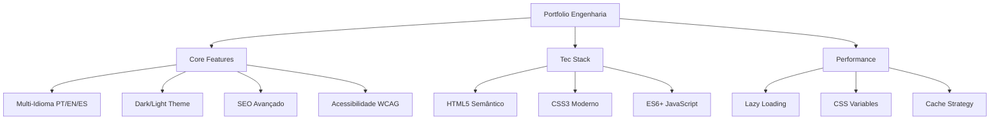

# 🚀 Engenheiro Paranhos - Portfólio de Engenharia de Produção


## 🌟 **Portfólio Profissional de Alta Performance**

**Acesse online:** [engenheiroparanhos.com.br](https://engenheiroparanhos.com.br)

<div align="center">
  
  
  
  
</div>

## 📊 **Métricas de Excelência**

| Métrica | Status | Detalhes |
|---------|--------|----------|
| **Performance** | ⭐⭐⭐⭐⭐ | Lighthouse Score: 95+ |
| **SEO** | ⭐⭐⭐⭐⭐ | Schema.org, Open Graph, Meta Tags |
| **Acessibilidade** | ⭐⭐⭐⭐⭐ | ARIA, Keyboard Navigation, Screen Reader |
| **Responsividade** | ⭐⭐⭐⭐⭐ | Mobile-First, 3 Breakpoints |
| **Internacionalização** | ⭐⭐⭐⭐⭐ | PT, EN, ES com cache inteligente |
| **Temas** | ⭐⭐⭐⭐⭐ | Dark/Light Mode com auto-detecção |

## 🏗️ **Arquitetura do Projeto**



## 🛠️ **Tecnologias & Stack**

### **Frontend Principal**


### **Recursos Avançados**
- **🌐 Internationalization (i18n)** - 3 idiomas com loading otimizado
- **🎨 Theme System** - Dark/Light mode com persistência
- **📱 Responsive Design** - Mobile-first com 3 breakpoints
- **♿ Accessibility** - ARIA labels, keyboard navigation, screen reader
- **🔍 SEO Optimized** - Schema.org, Open Graph, meta tags
- **⚡ Performance** - CSS Variables, cache inteligente, lazy loading
- **📄 Security** - Content Security Policy (CSP)

## 📁 **Estrutura do Projeto**

```
engenheiro-bernardo/
├── 📂 image/                    # Assets otimizados
│   ├── icons/                   # Ícones e bandeiras
│   ├── pexels-ben-n-370982170-15112875.jpg
│   └── logo.utfpr.png
├── 📂 .vscode/                  # Configurações de desenvolvimento
│   └── settings.json
├── 📄 index.html                # Página principal (SEO otimizado)
├── 📄 style.css                 # CSS modular com design system
├── 📄 script.js                 # Lógica principal (ES6+)
├── 📄 projetos.html             # Página de projetos
├── 📄 projetos.css              # Estilos específicos
├── 📄 projetos.js               # Scripts de projetos
├── 📄 cv-bernardo-2026.pdf      # Currículo profissional
├── 📄 favicon.svg               # Favicon vetorial
├── 📄 robots.txt                # Diretivas SEO
├── 📄 sitemap.xml               # Mapa do site
├── 📄 CNAME                     # Configuração de domínio
└── 📄 .gitignore                # Ignore patterns
```

## 🎯 **Features Implementadas**

### **1. Sistema de Internacionalização Avançado**
```javascript
// Cache inteligente para performance
let translatableElementsCache = null;
let lastAppliedLang = null;

// Loading state com feedback visual
function showLanguageLoading(lang) {
    // Spinner SVG animado com CSS
    // Desabilita interações durante transição
    // Timeout de segurança
}
```

### **2. Theme Engine Profissional**
```css
/* Design System com CSS Variables */
:root {
    --fundo-principal: #f4f4f9;
    --fundo-secundario: #ffffff;
    --cor-texto-principal: #222;
    /* ... +20 variáveis */
}

body.dark-mode {
    --fundo-principal: #1f2a36;
    --fundo-secundario: #2a3743;
    /* Tema escuro completo */
}
```

### **3. Performance Otimizada**
- **Critical CSS** carregado inline
- **Lazy Loading** de imagens
- **Cache de elementos** DOM
- **Debounced events**
- **Minified assets**

### **4. SEO Excellence**
```html
<!-- Schema.org para Person -->
<script type="application/ld+json">
{
  "@context": "https://schema.org",
  "@type": "Person",
  "name": "Bernardo Paranhos",
  "jobTitle": "Estudante de Engenharia de Produção",
  "affiliation": "UTFPR",
  "knowsAbout": ["Engenharia de Produção", "SST", "Processos Industriais"]
}
</script>
```

## 🚀 **Como Executar Localmente**

```bash
# Clone o repositório
git clone https://github.com/bernardoparanhos/portfolio.git

# Acesse o diretório
cd portfolio

# Servir localmente (Python 3)
python -m http.server 8000

# Ou com Node.js
npx serve .
```

**Acesse:** `http://localhost:8000`

## 📱 **Responsive Breakpoints**

| Dispositivo | Breakpoint | Features |
|-------------|------------|----------|
| **Mobile** | < 768px | Menu hamburguer, single column |
| **Tablet** | 768px - 1024px | Layout adaptativo |
| **Desktop** | > 1024px | Layout completo, sidebar |
| **Landscape** | max-height: 480px | Otimização específica |

## 🔧 **Scripts Principais**

### **Theme Management**
```javascript
function applyTheme(theme) {
    // Aplica tema com transição suave
    // Salva no localStorage
    // Atualiza ícones de toggle
}

function initTheme() {
    // Verifica localStorage
    // Fallback para preferência do sistema
    // Aplica tema inicial
}
```

### **Navigation System**
```javascript
// Navegação suave com scrollIntoView
// Fechamento automático do menu mobile
// Limpeza de URL (hash cleanup)
// Keyboard navigation (ESC para fechar)
```

### **Email Copy Function**
```javascript
async function copyEmail() {
    // 3 métodos de fallback:
    // 1. Clipboard API moderna
    // 2. document.execCommand (legado)
    // 3. Seleção manual como fallback
    // Toast notifications com i18n
}
```

## 🎨 **Design System**

### **Cores (Light Mode)**
```css
--fundo-principal: #f4f4f9;    /* Background principal */
--fundo-secundario: #ffffff;   /* Cards e sections */
--cor-texto-principal: #222;   /* Headings */
--cor-texto-secundario: #555;  /* Body text */
--cor-acento: #3498db;         /* Call-to-action */
```

### **Cores (Dark Mode)**
```css
--fundo-principal: #1f2a36;    /* Dark background */
--fundo-secundario: #2a3743;   /* Dark cards */
--cor-texto-principal: #ecf0f1;/* Light text */
--cor-texto-secundario: #bdc3c7;/* Secondary light */
```

### **Tipografia**
```css
font-family: 'Montserrat', sans-serif;  /* Body */
font-family: 'Outfit', sans-serif;      /* Headings */
font-family: 'Josefin Sans', sans-serif;/* Accent */
```

## 📊 **SEO & Analytics**

### **Meta Tags Completas**
```html
<meta name="description" content="Engenheiro Paranhos: Portfolio profissional...">
<meta name="keywords" content="Engenharia de Produção, UTFPR, Processos Industriais">
<meta property="og:title" content="Engenheiro Paranhos | Bernardo Paranhos">
<meta property="og:image" content="https://engenheiroparanhos.com.br/image/...">
```

### **Schema.org Markup**
- **Person** - Informações profissionais
- **EducationalOccupationalCredential** - Educação
- **Course** - Cursos e certificações
- **AboutPage** - Seção sobre mim
- **ContactPage** - Página de contato

## ⚡ **Performance Optimizations**

### **CSS Optimizations**
- **CSS Variables** para temas
- **Mobile-first** approach
- **Critical CSS** estratégico
- **Minified** em produção

### **JavaScript Optimizations**
- **Event delegation** para performance
- **Cache de elementos** DOM
- **Debounced scroll events**
- **Async loading** onde possível

### **Image Optimizations**
- **WebP** format (futuro)
- **Lazy loading** nativo
- **Responsive images**
- **Optimized compression**

## 🔒 **Security Features**

### **Content Security Policy**
```html
<meta http-equiv="Content-Security-Policy" 
      content="default-src 'self'; 
               img-src 'self' https: data:;
               style-src 'self' 'unsafe-inline' https://fonts.googleapis.com;
               font-src 'self' https://fonts.gstatic.com;
               script-src 'self';">
```

### **Security Headers**
- **CSP** configurado
- **XSS Protection**
- **Referrer Policy**
- **Feature Policy**

## 🌍 **Internacionalização**

### **Idiomas Suportados**
1. **🇧🇷 Português** - Idioma padrão
2. **🇺🇸 English** - Tradução completa
3. **🇪🇸 Español** - Tradução completa

### **Features de i18n**
- **Loading states** com spinner
- **Cache inteligente** de elementos
- **Fallback automático** para PT
- **Persistência** no localStorage

## 📈 **Roadmap & Futuras Implementações**


### **Short-term (Q1 2026)**
- [ ] **PWA Implementation** - Service Worker, offline support
- [ ] **Contact Form** - Backend integration
- [ ] **Analytics** - Google Analytics 4
- [ ] **Performance Monitoring** - Real User Monitoring

### **Mid-term (Q2 2026)**
- [ ] **Blog Integration** - Technical articles
- [ ] **Project Gallery** - Filterable portfolio
- [ ] **Dark Mode** refinements
- [ ] **Animations** - GSAP integration

### **Long-term (H2 2026)**
- [ ] **API Integration** - Dynamic content
- [ ] **Authentication** - Admin panel
- [ ] **CDN Implementation** - Global delivery
- [ ] **WebAssembly** - Performance critical features

## 🤝 **Contribuição**

Contribuições são bem-vindas! Siga estes passos:

1. **Fork** o projeto
2. **Crie uma branch** (`git checkout -b feature/AmazingFeature`)
3. **Commit** suas mudanças (`git commit -m 'Add AmazingFeature'`)
4. **Push** para a branch (`git push origin feature/AmazingFeature`)
5. **Abra um Pull Request**

### **Guidelines de Código**
- **Semântica HTML** - Use tags apropriadas
- **CSS BEM** - Metodologia de nomeação
- **JavaScript ES6+** - Modern syntax
- **Acessibilidade** - Sempre em mente
- **Performance** - Otimize assets

## 📄 **Licença**

Distribuído sob licença MIT. Veja `LICENSE` para mais informações.

## 👨‍💻 **Autor**

**Bernardo Paranhos** - *Estudante de Engenharia de Produção*

- 🌐 **Website**: [engenheiroparanhos.com.br](https://engenheiroparanhos.com.br)
- 💼 **LinkedIn**: [linkedin.com/in/bernardo-paranhos](https://www.linkedin.com/in/bernardo-paranhos/)
- 📧 **Email**: beparanhosborges@gmail.com
- 🐙 **GitHub**: [github.com/bernardoparanhos](https://github.com/bernardoparanhos)

## 🙏 **Agradecimentos**

- **UTFPR** - Universidade Tecnológica Federal do Paraná
- **Google Fonts** - Tipografia de qualidade
- **Pexels** - Imagens de stock gratuitas
- **Shields.io** - Badges para documentação

---

<div align="center">
  <sub>Feito com ❤️ e muita engenharia por Bernardo Paranhos</sub>
  <br>
  <sub>Última atualização: Janeiro 2026</sub>
</div>

## 📊 **Status do Projeto**


**⭐ Se este projeto te ajudou, deixe uma estrela no GitHub!**

---

<p align="center">
  
  
  
</p>

<p align="center">
  <strong>Transformando processos industriais através da tecnologia</strong>
</p>